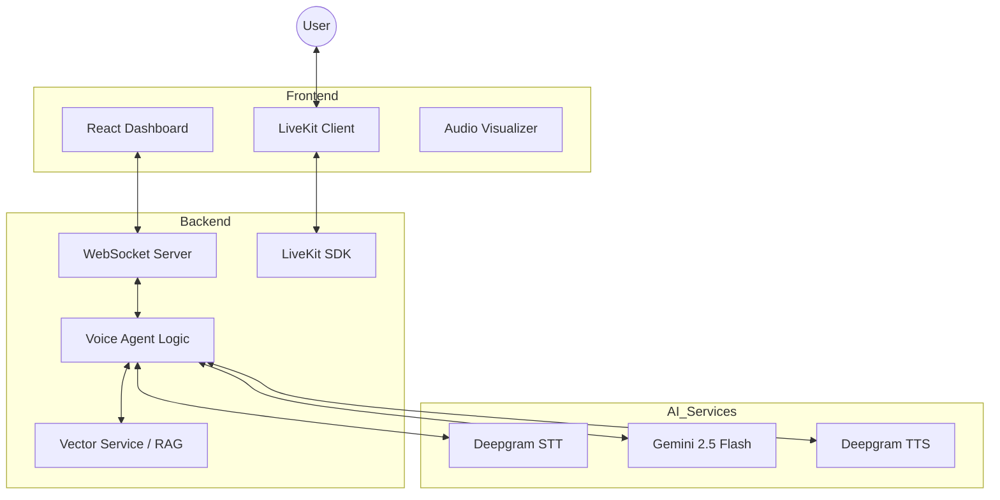

# 🎙️ Real-Time Voice Agent with RAG

A high-performance, WebRTC-powered voice assistant featuring **LiveKit**, **Gemini 2.0 Flash**, and **Deepgram**. This platform allows for natural voice conversations with a custom Knowledge Base using RAG (Retrieval-Augmented Generation).

---

## 🚀 Quick Start

### 1. Prerequisites
- **Node.js**: v18 or later
- Accounts: 
  - [LiveKit Cloud](https://cloud.livekit.io/) (or local server)
  - [Google AI Studio](https://aistudio.google.com/) (for LLM & Embeddings)
  - [Deepgram](https://console.deepgram.com/) (for STT/TTS)

### 2. Setup Environment
Navigate to the `backend/` directory and create a `.env` file:
```bash
# LiveKit Configuration
LIVEKIT_URL=wss://your-project.livekit.cloud
LIVEKIT_API_KEY=your_api_key
LIVEKIT_API_SECRET=your_api_secret

# AI Services
GEMINI_API_KEY=your_gemini_key
DEEPGRAM_API_KEY=your_deepgram_key
```

### 3. Installation & Execution

#### **Backend**
```bash
cd backend
npm install
node server.js
```
*Backend runs on `http://localhost:3000`*

#### **Frontend**
```bash
cd frontend
npm install
npm run dev
```
*Frontend runs on `http://localhost:5173`*

---

## 🛠️ Infrastructure: LiveKit

### Cloud Setup (Recommended)
1. Sign up at [LiveKit Cloud](https://cloud.livekit.io/).
2. Create a new project.
3. Copy the **Project URL**, **API Key**, and **API Secret** into your backend `.env`.
4. Update the `LIVEKIT_URL` in `frontend/src/hooks/useVoiceAgent.js`.


---

## 🏗️ System Architecture



---

## 🖥️ UI Dashboard Guide

The interface is divided into a high-productivity dashboard layout:

### 1. Left Sidebar
- **Knowledge Base**: Real-time document ingestion. Upload `.txt` or `.md` files to immediately expand the agent's context.
- **System Logs**: A live terminal-style feed of background events (WebSocket status, STT events, connectivity logs).

### 2. Dashboard Header
- **Status Indicator**: Shows if the system is "Online" or "Idle".
- **Mic Control**: Toggle your microphone on/off during an active session.
- **Terminate Session**: Gracefully close WebRTC and WebSocket connections.

### 3. Control Panel
- **Voice Frequency Visualizer**: Real-time indigo gradient bars reflecting the agent's speech intensity.
- **Agent Persona Editor**: Customize the AI's personality and instructions on the fly.

### 4. Main Interaction Area
- **Live Conversation**: A fixed-height, auto-scrolling transcript area showing real-time text of the conversation.
- **Retrieved Context (RAG)**: A dynamic horizontal panel that appears at the bottom only when the agent pulls information from your uploaded Knowledge Base.

## 🧠 Key Features

| Feature | Implementation | Performance |
| :--- | :--- | :--- |
| **Connectivity** | WebRTC (LiveKit) | Sub-100ms latency |
| **Transcription** | Deepgram Nova-2 | Industry-leading accuracy |
| **Brain** | Gemini 2.5 Flash | Ultra-fast reasoning & context |
| **Voice** | Deepgram Aura | Human-like natural prosody |
| **RAG** | VectorService (Local) | gemini-embedding-001 |

---

## 📖 Usage Guide

1. **Upload Documents**: Use the "Knowledge Base" panel to upload `.txt` or `.md` files. They are indexed in real-time.
2. **Configure Persona**: Update the "Agent Persona" text area to change how the agent behaves (e.g., "Act as a helpful doctor").
3. **Start Session**: Click **Start Voice Session**. The app handles WebRTC handshakes and microphone permissions.
4. **Interact**: Speak naturally. The "Retrieved Context" will pop up automatically if the agent uses your uploaded documents to answer.

---

## ⚠️ Limitations & Tradeoffs

- **Local Vector Store**: The current RAG implementation uses an in-memory vector store. Documents are cleared when the backend restarts. For production, consider using Pinecone or Weaviate.
- **Single Room Focus**: The demo assumes a shared `demo-room`. In a multi-user production environment, unique room names based on session IDs should be generated.
- **In-Memory History**: Conversation memory is stored per-session in the backend. 
- **Audio Worklet Context**: Users must perform a user gesture (click "Start") before the browser allows audio capture, which is handled in the UI.

---


